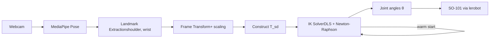

# DEVLOG

Development log for markerless teleoperation project using LeRobot's SO-101 arm. 

----

## ENTRY 1 - Setup and goals

Lay foundation, validate perception, kinematics & IK independently.

### Goal

Build a markerless teleoperation pipelie for the SO-101 5-DOF robot arm. User's arm motion is captured by a standard webcam, processed via pose estimation, and translated into joint commands that drive the physical robot in real time.
No wearable trackers, no IMUs, no fiducial markers.

### Motivation

Most teleoperation systems rely on expensive motion-capture hardware or wearable trackers.
This project explores how far I can get with a single webcam and from-scratch kinematics, useful for low-cost teleop, demonstrations.
Will serve as a learning exercise in robotics fundamentals (kinematics, IK, frame transformations, real-time control).

### Tech stack

| Component | Tool |
|-----------|------|
| Perception | MediaPipe Pose Landmarker (`pose_world_landmarks`) |
| Kinematics | Custom Python implementation (Product-of-Exponentials formulation) |
| Robot description | URDF (parsed with custom script) |
| Hardware interface | `lerobot` library for SO-101 |
| Visualization / verification | `urdfpy`, `matplotlib` |
| Language | Python 3.10 |

### Pipeline architecture

### Repo structure 
modern_robotics/
├── README.md            # new — layout, setup, how to run
├── DEVLOG.md            # unchanged
├── requirements.txt     # numpy, matplotlib, mediapipe, opencv-python, yourdfpy
├── .gitignore           
├── kinematics/
│   ├── core.py          # trimmed from Northwestern's Modern Robotics lib — 18 functions (was 40+)
│   └── ik.py            # IKinBodyDLS
├── urdf/
│   ├── parser.py        # findMnS + rpyToRot (no more module globals; path-safe)
│   └── so101_new_calib.urdf
├── perception/
│   ├── pose_detector.py # draw_landmarks_on_image
│   ├── image_mapping.py # still-image demo
│   └── video_mapping.py # webcam demo
├── models/
│   └── pose_landmarker_heavy.task   # 30 MB, git-ignored
└── tests/
    ├── robot.py         # shared M, Slist, Blist, limits fixtures
    ├── test_fk.py       # verify_fk + driver
    ├── test_jacobian.py # verify_jac + driver
    └── test_ik.py       # round_trip, verify_singular, noise_sweep + driver

### Scope and constraints (v1)

- **2D first**: target end-effector position in the (x, y) plane of the robot base; z held constant
- **Fixed orientation**: gripper orientation locked to a sensible constant pose, not tracked from the user
- **Single webcam**: monocular depth limitations accepted; stereo extension deferred
- **Position-only target**: orientation tracking and finger/gripper control deferred to later phases

### Current status

| Module | State | Verified against |
|--------|-------|------------------|
| URDF parser | Working | Manual inspection, FK consistency |
| FK (space & body) | Working | `urdfpy` cross-validation, N random configs |
| Jacobians (space & body) | Working | Numerical differentiation |
| IK (DLS, body frame) | Working | Round-trip, convergence radius, unreachable, singularity tests |
| Pose tracker | Working | Live webcam, returns world landmarks |
| **Bridge layer** (perception → IK input) | Next | — |
| Hardware execution | Pending | — |
