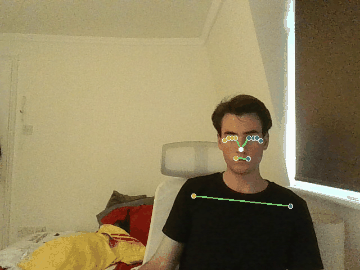

# DEVLOG

Development log for markerless teleoperation project using LeRobot's SO-101 arm.

> **A note on ordering.** This is a journal, but the foundation layer (Entries 1-6)
> is written up *retrospectively*: perception, URDF parsing, FK, Jacobians, and IK
> were each built and verified in isolation before being documented here, so these
> entries are arranged in **logical build order** (each depends on the one before)
> rather than strict diary chronology. True chronological journaling resumes at the
> bridge layer (Entry 7+), where design and implementation happen alongside writing.
> A polished reference doc will be written at the end of the project, drawing on this
> log as raw material.

----

## Contents
- [Entry 1: Project Setup & Goals](#entry-1---setup-and-goals)
- [Entry 2: Perception Layer: MediaPipe Pose Tracking](#entry-2---perception-layer-mediapipe-pose-tracking)
- [Entry 3: URDF Parsing & Kinematic Description](#entry-3---urdf-parsing--kinematic-description)
  - [Frames & Conventions (reference)](#frames--conventions-reference)
- [Entry 4: Forward Kinematics](#entry-4---forward-kinematics)
- [Entry 5: Jacobians](#entry-5---jacobians)
- [Entry 6: Inverse Kinematics](#entry-6---inverse-kinematics)

----

## ENTRY 1 - Setup and goals

Lay foundation, validate perception, kinematics & IK independently.

### Goal

Build a markerless teleoperation pipelie for the SO-101 5-DOF robot arm. User's arm motion is captured by a standard webcam, processed via pose estimation, and translated into joint commands that drive the physical robot in real time.
No wearable trackers, no IMUs, no fiducial markers.

### Motivation

Most teleoperation systems rely on expensive motion-capture hardware or wearable trackers.
This project explores how far I can get with a single webcam and from-scratch kinematics, useful for low-cost teleop, demonstrations.
Will serve as a learning exercise in robotics fundamentals (kinematics, IK, frame transformations, real-time control).

### Tech stack

| Component | Tool |
|-----------|------|
| Perception | MediaPipe Pose Landmarker (`pose_world_landmarks`) |
| Kinematics | Custom Python implementation (Product-of-Exponentials formulation) |
| Robot description | URDF (parsed with custom script) |
| Hardware interface | `lerobot` library for SO-101 |
| Visualization / verification | `yourdfpy`, `matplotlib` |
| Language | Python 3.10 |

### Pipeline architecture


The dotted feedback edge is the **warm start**: the iterative IK solver needs an
initial guess, so each frame seeds the solve with the previous frame's solution.
This is faster (the target moves little between frames) and keeps the joint
trajectory temporally smooth. It is enabled by the solver's `thetalist0` argument
and will be driven by the bridge layer (Entry 7+).

### Repo structure

```text
so101-markerless-teleop/
├── README.md            # layout, setup, how to run
├── DEVLOG.md            # this file
├── pyproject.toml       # editable-install packaging (kinematics, urdf, perception, tests)
├── requirements.txt     # numpy, matplotlib, mediapipe, opencv-python, yourdfpy
├── .gitignore
├── kinematics/
│   ├── core.py          # trimmed Modern Robotics lib, 18 functions (was 40+)
│   └── ik.py            # IKinBodyDLS
├── urdf/
│   ├── parser.py        # findMnS + rpyToRot (path-safe, no module globals)
│   └── so101_new_calib.urdf
├── perception/
│   ├── pose_detector.py # draw_landmarks_on_image
│   ├── image_mapping.py # still-image demo
│   └── video_mapping.py # webcam demo
├── models/
│   └── pose_landmarker_heavy.task   # 30 MB, git-ignored
└── tests/
    ├── robot.py         # shared M, Slist, Blist, limits fixtures
    ├── test_fk.py       # verify_fk + driver
    ├── test_jacobian.py # verify_jac + driver
    └── test_ik.py       # round_trip, verify_singular, noise_sweep + driver
```

### Scope and constraints (v1)

- **2D first**: target end-effector position in the (x, y) plane of the robot base; z held constant
- **Fixed orientation**: gripper orientation locked to a sensible constant pose, not tracked from the user
- **Single webcam**: monocular depth limitations accepted; stereo extension deferred
- **Position-only target**: orientation tracking and finger/gripper control deferred to later phases

### Current status

| Module | State | Verified against |
|--------|-------|------------------|
| URDF parser | Working | Manual inspection, FK consistency |
| FK (space & body) | Working | `yourdfpy` cross-validation, N random configs |
| Jacobians (space & body) | Working | Numerical differentiation |
| IK (DLS, body frame) | Working | Round-trip, convergence radius, unreachable, singularity tests |
| Pose tracker | Working | Live webcam, returns world landmarks |
| **Bridge layer** (perception → IK input) | Next | n/a |
| Hardware execution | Pending | n/a |

----

## Entry 2 - Perception Layer: MediaPipe Pose Tracking

### Goal
Turn a webcam feed into a stream of 3D arm landmarks usable as an IK target, with no markers or wearables.

### Approach
MediaPipe Pose Landmarker (heavy model, VIDEO running mode) on each frame. The
detector exposes two landmark sets; the choice between them is the central decision
of this entry.

### Implementation notes
- `perception/pose_detector.py::draw_landmarks_on_image` overlays the skeleton for visual debugging and returns `pose_world_landmarks` (see [Decisions]).
- `perception/image_mapping.py`: single-image smoke test (run on a still photo).
- `perception/video_mapping.py`: live webcam loop at VIDEO running mode; now raises immediately if no camera is available rather than spinning on empty frames.
- Right arm is used: landmark **12 = shoulder**, **16 = wrist**. The shoulder is the **anchor**: all target coordinates are expressed relative to it, so the mapping is invariant to where the user stands in frame.

### Verification
No unit test here; perception is verified **visually**, since the ground truth is "does the skeleton track my arm." Two manual checks:
- `image_mapping.py` on a still photo → annotated skeleton overlay is correct.
- `video_mapping.py` live → landmarks track the arm in real time; shoulder/wrist indices are the expected joints.

Below is an example of the annotated output from the video mapping script: `docs/media/`.



Regenerate with:

```sh
python -m perception.image_mapping path/to/arm_photo.jpg   # saves docs/media/pose_detection.png
python -m perception.video_mapping                         # press q to stop; saves docs/media/live_tracking.gif
```

### Decisions & open questions
- **`pose_world_landmarks` over `pose_landmarks`.** `pose_landmarks` are normalized image coordinates (0 to 1, image-relative) with no metric scale and entangled with camera framing. `pose_world_landmarks` are in **metres, body-relative** (origin near the hips), which is what kinematics needs. We use world landmarks.
- **Shoulder-as-anchor** makes the signal translation-invariant (user can move around the frame).
- **Monocular depth is unreliable.** A single camera cannot recover absolute depth well. This is *the* reason for the 2D-first scope (Entry 1): target the base (x, y) plane, hold z constant. Depth via stereo/learned priors is deferred.
- Open: temporal smoothing / jitter filtering on the landmark stream is not yet implemented; likely needed before driving hardware.

----

## Entry 3 - URDF Parsing & Kinematic Description

### Goal
Convert the SO-101 URDF into the Product-of-Exponentials (PoE) quantities the kinematics need: the home pose `M`, the space-frame screw axes `Slist`, and joint `limits`.

### Approach: why PoE over DH
Denavit-Hartenberg requires per-joint frame assignments with fiddly conventions and is error-prone to derive by hand. PoE needs only, for each joint, a **screw axis expressed in the base frame at the home configuration** plus one home transform `M`. It maps directly onto URDF data (axis + origin per joint) and avoids intermediate frame bookkeeping. Implemented in `urdf/parser.py::findMnS`.

### Implementation notes
- **Building `M`.** Walk the joints and chain their local link transforms (`T = T @ T_local`), where each `T_local` is built from the joint `origin` (`xyz` translation + `rpy` rotation). After the full chain, `T` is the home pose of the end-effector, `M`.
- **Building `Slist`.** For each revolute joint, the screw axis at home is

  $$\mathcal{S}_i = \begin{bmatrix}\omega_i \\ v_i\end{bmatrix},\qquad \omega_i = R_{\text{cumulative}}\, \hat{a}_i,\qquad v_i = -\,\omega_i \times q_i$$

  where $\hat{a}_i$ is the joint's local axis, $R_{\text{cumulative}}$ is the rotation of the chain up to that joint, and $q_i$ is a point on the axis (the joint origin in the base frame, `T[:3,3]`).
- **The bug-avoidance note (the subtle part):** both $\omega$ and $q$ must be expressed in the **base frame**, not parent-relative. The local axis is rotated into the base frame by $R_{\text{cumulative}}$, and $q$ is taken from the accumulated `T`, *not* from the per-joint origin. Getting either parent-relative silently produces a wrong-but-plausible model that only FK cross-validation (Entry 4) catches.
- **Joint walk:** joints are traversed in **reversed URDF order**, **arm joints only** (the `gripper` joint is skipped). Joint limits are read from each `<limit>` tag into `limits` as `[lower, upper]` rows.
- **`rpyToRot` convention:** fixed-axis roll-pitch-yaw, composed as $R = R_z(y)\,R_y(p)\,R_x(r)$, matching the URDF/ROS RPY convention.

### Verification
No standalone parser test; correctness is established **transitively**: if `M`/`Slist` were wrong, FK would not match the independent `yourdfpy` model (Entry 4). That cross-validation passing to machine precision is the parser's proof.

### Decisions & open questions
- Gripper joint deliberately excluded; v1 is position-only, 5 arm DOF.
- `findMnS` is path-safe (resolves the bundled URDF relative to the source file) and holds no module-level globals.
- Open: the reversed-joint-walk assumes a specific URDF ordering; a more robust parser would build the kinematic tree explicitly rather than relying on document order.

### Frames & Conventions (reference)
*One place to fix the conventions every later entry depends on.*

| Symbol | Meaning |
|--------|---------|
| `{s}` | Space/base frame (URDF `base_link`) |
| `{b}` | Body frame, the end-effector (URDF `gripper_frame_link`) |
| `M` | Home configuration of `{b}` relative to `{s}` (4×4) |
| `Slist` | Space-frame screw axes at home, columns (6×n), from `findMnS` |
| `Blist` | Body-frame screw axes at home, columns (6×n), derived in `tests/robot.py` |
| `T_sd` | **Desired** end-effector config (the IK target) in `{s}` |
| `T_sb` | **Current** end-effector config in `{s}` |

- **Space ↔ body conversion:** $\mathcal{B}_i = [\mathrm{Ad}_{M^{-1}}]\,\mathcal{S}_i$ (`tests/robot.py` builds `Blist` from `Slist` this way).
- **FK** comes in two equivalent forms: the *space* form uses `(M, Slist)`, the *body* form uses `(M, Blist)` (Entry 4).
- **IK operates in the body frame** (uses `Blist`), with error measured as a **body twist** $\mathcal{V}_b = \log(T_{sb}^{-1}T_{sd})$ (Entry 6).
- **Units:** metres, radians. **Joint order** (matches `Slist` columns): `[shoulder_pan, shoulder_lift, elbow_flex, wrist_flex, wrist_roll]`.

----

## Entry 4 - Forward Kinematics

### Goal
Map joint angles θ to the end-effector pose `T ∈ SE(3)`, in both space and body PoE forms, and prove it correct.

### Approach
Two equivalent Product-of-Exponentials formulations (`kinematics/core.py`):

$$\text{FKinSpace:}\quad T(\theta) = e^{[\mathcal{S}_1]\theta_1}\,e^{[\mathcal{S}_2]\theta_2}\cdots e^{[\mathcal{S}_n]\theta_n}\,M$$

$$\text{FKinBody:}\quad T(\theta) = M\,e^{[\mathcal{B}_1]\theta_1}\,e^{[\mathcal{B}_2]\theta_2}\cdots e^{[\mathcal{B}_n]\theta_n}$$

The two agree for the same θ **because** `Blist` is defined as $[\mathrm{Ad}_{M^{-1}}]\mathcal{S}$, so "FKinSpace ≡ FKinBody" is a genuine consistency check between two code paths, not a tautology.

### Verification
**`tests/test_fk.py`**: *cross-validation against an independent library.* For each test configuration it computes the pose two ways: my `FKinSpace(M, Slist, θ)` and `yourdfpy`'s `URDF.get_transform("gripper_frame_link", "base_link")` after setting the same joint config. It reports the max absolute element-wise difference of the two 4×4 matrices; PASS if `< 1e-4`. This catches any error in the parser (`M`, `Slist`) or the exponential maps.

```
PASS  max_err=2.22e-16  theta=[0 0 0 0 0]
PASS  max_err=1.11e-16  theta=[-0.393  0.     0.     0.     0.   ]
PASS  max_err=1.53e-16  theta=[0.    0.785 0.    0.    0.   ]
PASS  max_err=3.33e-16  theta=[ 0.     0.    -0.785  0.     0.   ]
PASS  max_err=4.44e-16  theta=[ 0.393 -0.785  0.524 -0.393  1.047]
```

Errors are at the level of floating-point round-off (~1e-16), i.e. the two models are identical to machine precision across configs spanning all five joints.

### Decisions & open questions
- Both forms kept: the space form pairs with the space Jacobian (Entry 5), the body form is what IK iterates on (Entry 6).
- `yourdfpy` chosen as the reference precisely because it is an *independent* implementation; a bug shared with my code would have to coincide, which is vanishingly unlikely at 1e-16 agreement.

----

## Entry 5 - Jacobians

### Goal
Provide the manipulator Jacobian J(θ) relating joint rates to the end-effector twist: the linearization the IK solver steps along.

### Approach
`JacobianSpace(Slist, θ)` and `JacobianBody(Blist, θ)` (`kinematics/core.py`), each column the screw axis transformed by the accumulated exponentials up to that joint.

### Verification
**`tests/test_jacobian.py`**: *numerical differentiation vs the analytical Jacobian.* For each joint i it perturbs θᵢ by a small step (`1e-4`), recomputes FK, and forms the spatial twist numerically from $\dot{T}\,T^{-1}$, reading $\omega$ off the skew-symmetric part and $v$ off the translation. It compares this finite-difference Jacobian to `JacobianSpace`; PASS if max error `< 1e-4`.

```
PASS  max_err=1.17e-05  theta=[0. 0. 0. 0. 0.]
PASS  max_err=1.77e-05  theta=[-0.393  0.     0.     0.     0.   ]
PASS  max_err=2.50e-05  theta=[0.    0.785 0.    0.    0.   ]
PASS  max_err=2.50e-05  theta=[ 0.     0.    -0.785  0.     0.   ]
PASS  max_err=2.23e-05  theta=[ 0.393 -0.785  0.524 -0.393  1.047]
```

Errors sit at ~1e-5, limited by the finite-difference step, not the analytical Jacobian (FK itself is exact to 1e-16 from Entry 4), exactly as expected for a first-order difference.

### Decisions & open questions
- **Condition-number observation → IK design.** Near singular configurations $J$ becomes ill-conditioned and a naive inverse step blows up. Measuring $\mathrm{cond}(J)$ here directly motivates the **damped least-squares** step in Entry 6: the damping term $\lambda^2 I$ is precisely what keeps $J J^T + \lambda^2 I$ invertible when $J$ loses rank. Entry 5 measures the problem; Entry 6 is the fix.
- Open: a richer singularity study (sweeping configs, plotting cond(J) over the workspace) would better characterize where damping matters most.

----

## Entry 6 - Inverse Kinematics

### Goal
Given a desired pose `T_sd`, solve for joint angles θ that reach it, robustly and within joint limits: the core of the teleop loop.

### Approach: Newton-Raphson with damped least-squares
Iterate in the **body frame**. At each step compute the body-twist error to the target and take a damped least-squares step:

$$\mathcal{V}_b = \log\!\big(T_{sb}^{-1}\,T_{sd}\big),\qquad \Delta\theta = J_b^{T}\big(J_b J_b^{T} + \lambda^2 I\big)^{-1}\mathcal{V}_b$$

Implemented in `kinematics/ik.py::IKinBodyDLS`. Iterate until both the angular (`eomg`) and linear (`ev`) error tolerances are met, or `maxiters` is hit.

### Decisions & open questions
- **DLS over plain pseudoinverse.** The damping $\lambda^2 I$ regularizes the step near singularities where $J_b$ loses rank (the Entry 5 motivation). *Caveat from testing:* the bundled `verify_singular` config (`shoulder_lift = π/2`) is only mildly ill-conditioned (cond ≈ 30), so DLS and pinv happen to behave identically on it, both converging in 2 iterations. The robustness payoff shows up instead in the noise sweep below, and DLS's advantage would widen at genuinely rank-deficient configs.

  ```
  Jacobian condition number at config: 29.6
  DLS  (lam=0.05): converged in 2 iters, max|theta|=1.67
  Pinv           : 2 iters,            max|theta|=1.67
  ```

- **In-loop joint clamping (decided empirically).** Joint limits are re-clamped *every iteration*, not just on the final result. An earlier docstring claimed in-loop clamping "corrupts the gradient and prevents convergence." The data says the opposite. Re-running the round-trip success sweep both ways (200 trials per noise level, identical seeds):

  ```
    noise |  in-loop clamp |  end-only clamp
  ------------------------------------------
     0.00 |         100.0% |          100.0%
     0.01 |         100.0% |          100.0%
     0.10 |         100.0% |          100.0%
     0.50 |          98.5% |           98.0%
     0.75 |          96.5% |           95.0%
     1.00 |          95.0% |           86.0%
     1.25 |          90.0% |           70.0%
     1.50 |          85.5% |           59.0%
     2.00 |          83.0% |           35.0%
     5.00 |          72.5% |            1.0%
  ```

  The two are equivalent for small initial-guess error but diverge sharply as the guess worsens: at ~2 rad off, **83% vs 35%**; at 5 rad, **72.5% vs 1%**. Keeping each iterate inside the reachable joint space stops the solver wandering into unreachable regions it can't recover from. **Decision: clamp in-loop.** (Docstring corrected to match.)
- **NaN/Inf guard.** If a step produces non-finite values (degenerate Jacobian solve), the solver bails and returns the last good θ with `success=False` rather than propagating NaNs into joint commands.
- **Warm starting** is *not* a feature of the solver itself; `IKinBodyDLS` simply exposes an initial-guess argument (`thetalist0`). Warm starting is **realized by the bridge layer** (Entry 7+), which will seed each frame's solve with the previous frame's solution. Documenting it here only as the affordance the signature provides; the round-trip test above already exploits it by perturbing the true θ as the seed.

### Verification
**`tests/test_ik.py`**: three checks:
- **`round_trip`**: *core correctness test.* Sample a random valid θ, FK it to a target `T_sd`, perturb θ by noise to make the initial guess, run IK, and confirm the solution reproduces the target pose (within tolerance). Non-converged solves count as failures. Reported as a success rate.
- **`verify_singular`**: steps DLS vs plain pseudoinverse near a near-singular config and plots the joint trajectories (prints the condition number; see caveat above).
- **`noise_sweep`**: round-trip success rate across a range of initial-guess noise levels, the **convergence-radius** characterization (the in-loop-clamp table above is this sweep, run for both clamping modes).

Default driver output (round-trip, noise = 1 rad, 100 trials; stochastic, no fixed seed):

```
round-trip success (noise=1): 0.90
```

### Open questions
- Tune `λ`, `eomg`, `ev` against the real control loop's rate and noise once hardware is connected.
- Add an explicit reachability/limit pre-check so unreachable teleop targets are reported rather than silently clamped to the nearest feasible pose.
